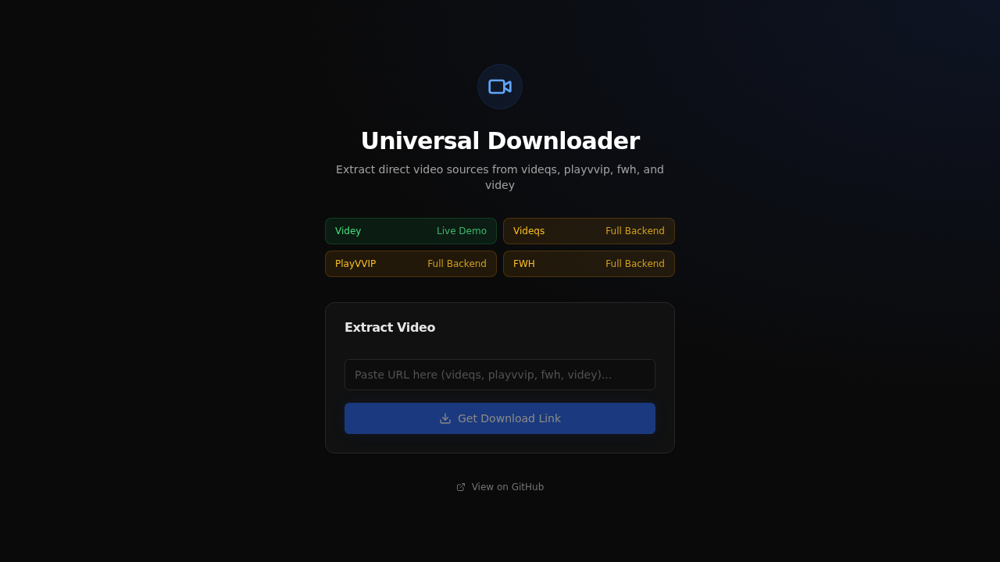

<div align="center">
  
  <h1>Universal Downloader</h1>
  <p><strong>Extract direct video sources from video hosting sites</strong></p>

  <p>
    
    
    
    
    
  </p>
  <p>
    
    
    
    
    <a href="https://github.com/codespaces/new?repo=mifdlaldev/link-download"></a>
    <a href="https://vercel.com/new/clone?repository-url=https://github.com/mifdlaldev/link-download"></a>
  </p>
</div>

---

## Live Demo

**[Try the live demo!](https://link-download.vercel.app)** — Free, no credit card, always online.

| Provider | Live Demo | Full Backend |
|---|---|---|
| **Videy.co** | ✅ Works directly | ✅ |
| **Videqs.download** | ❌ Needs local backend | ✅ |
| **Playvvip.top** | ❌ Needs local backend | ✅ |
| **Fwh.is** | ❌ Needs local backend | ✅ |

> **Why can't all providers work on the live demo?**
> Providers like `videqs.download`, `playvvip.top`, and `fwh.is` require a headless Chromium browser (Playwright) to render JavaScript and intercept video streams. Playwright needs ~300MB of browser binary + 1-2GB of RAM — this cannot run on serverless platforms like Vercel (max 10s timeout, no persistent processes).
>
> Platforms that do support Docker + Playwright (Render, Fly.io, Railway) either require a credit card or have usage limits that eventually cost money — typically $5-7/month.
>
> This is a deliberate **engineering trade-off**: the live demo showcases the UI and `videy.co` flow. Full extraction is available via free alternatives below.

### Free Ways to Run the Full Backend

| Method | Cost | Credit Card | Setup Time |
|---|---|---|---|
| **[GitHub Codespaces](https://github.com/codespaces/new?repo=mifdlaldev/link-download)** | Free (60h/month) | ❌ Not needed | 1 click |
| **[Local / Docker](https://github.com/mifdlaldev/link-download#quick-start)** | Free (forever) | ❌ Not needed | ~2 minutes |

---

## Screenshot



---

## Features

- **Multi-provider extraction** — Supports `videqs.download`, `playvvip.top`, `fwh.is`, and `videy.co`
- **Direct resolution** — Videy.co URLs resolved instantly without launching a browser
- **Smart media detection** — Playwright headless Chrome intercepts network traffic and scans DOM for media sources
- **Heuristic scoring** — 15+ scoring rules to pick the best media candidate while filtering ads and trackers
- **Production-grade security** — Helmet, CORS, rate limiting, Zod input validation, structured error handling
- **Proxy download** — Streams media through the backend with proper headers, supporting range requests
- **Comprehensive testing** — 99 tests (unit + integration), 90%+ coverage
- **Docker ready** — One-command setup with Docker Compose
- **CI/CD** — GitHub Actions auto-test every push; Husky pre-commit hooks

---

## Tech Stack

| Layer | Technology |
|---|---|
| **Backend** | Express 5, TypeScript (strict), Playwright 1.42, Zod 4, Pino |
| **Frontend** | React 19, Vite 8, Tailwind CSS 3, shadcn/ui, Lucide icons |
| **Testing** | Vitest, Supertest, V8 coverage |
| **DevOps** | Docker Compose, Husky, lint-staged, GitHub Actions |

---

## Architecture

```
┌──────────────────────────────────────┐
│         Vercel (Free, No CC)         │
│                                      │
│  ┌──────────────────────────────┐    │
│  │  Frontend (React SPA)        │    │  Always UP
│  └──────────────────────────────┘    │
│  ┌──────────────────────────────┐    │
│  │  Serverless API              │    │  videy.co direct resolve
│  │  /api/v1/extract             │    │  (no Playwright needed)
│  └──────────────────────────────┘    │
└──────────┬───────────────────────────┘
           │ (other providers)
           ▼
┌──────────────────────────────────────┐
│  GitHub Codespaces / Local (Free)    │
│                                      │
│  ┌──────────────────────────────┐    │
│  │  Full Backend + Playwright   │    │  All providers
│  └──────────────────────────────┘    │
└──────────────────────────────────────┘
```

### Extraction Flow

```
User paste URL → POST /api/v1/extract

  ├─ videy.co → resolve to cdn.videy.co/{id}.mp4 (no browser)

  └─ other providers → Playwright headless Chromium
       ├─ Intercept network responses → filter for media
       ├─ Scan DOM for <video>/<audio>/<source> tags
       ├─ Score candidates (15+ heuristics)
       └─ Return best match + required headers
```

### Module Structure

```
backend/
├── src/
│   ├── index.ts              Express app entry
│   ├── config.ts             Zod-validated environment
│   ├── logger.ts             Pino structured logger
│   └── extractor/
│       ├── errors.ts         Custom error classes (400/404/502/503/500)
│       ├── helpers.ts        17 pure utility functions
│       ├── schemas.ts        Input validation schemas
│       ├── browser.ts        Playwright lifecycle
│       ├── routes.ts         Route handlers
│       └── providers/
│           └── videy.ts      Videy direct resolver
└── src/__tests__/            99 tests (Vitest)
    ├── helpers.test.ts
    ├── schemas.test.ts
    └── routes.test.ts
```

---

## Quick Start

### GitHub Codespaces (1 Click, Free)

[](https://github.com/codespaces/new?repo=mifdlaldev/link-download)

Click the badge above. Codespaces automatically installs dependencies and Playwright. No credit card needed. 60 hours/month free.

### Local Development

```bash
git clone https://github.com/mifdlaldev/link-download.git
cd link-download

# Backend
cd backend
npm install
npm run playwright:install  # Installs Chromium for Playwright
npm run dev                  # Starts on localhost:3001

# Frontend (new terminal)
cd frontend
npm install
npm run dev                  # Starts on localhost:5173
```

### Docker (One Command)

```bash
docker compose up
```

---

## API Reference

### POST /api/v1/extract

Extract a downloadable video URL from a supported provider.

**Request:**
```json
{ "url": "https://videqs.download/abc123" }
```

**Success (200):**
```json
{
  "meta": { "status": 200, "message": "Success" },
  "data": {
    "title": "Video Title",
    "downloadUrl": "https://cdn.provider.com/video.mp4",
    "headersRequired": { "referer": "https://source.com/" },
    "expiresIn": 3600,
    "provider": "videqs",
    "deliveryMethod": "proxy",
    "proxyDownloadUrl": "/api/v1/extract/download?source=..."
  }
}
```

| Status | Meaning |
|---|---|
| `200` | Video extracted successfully |
| `400` | Invalid URL or unsupported domain |
| `404` | No media stream found |
| `429` | Rate limited (5 req/min) |
| `501` | Provider needs full backend (Playwright) |
| `503` | Playwright browser not installed |

### GET /api/v1/extract/download

Proxy download a media stream. Used internally by `proxyDownloadUrl`.

| Param | Required | Description |
|---|---|---|
| `source` | ✅ | Direct media URL from extraction |
| `headers` | ✅ | Base64url-encoded JSON of request headers |
| `filename` | ❌ | Custom filename |

Supports partial content (range requests) for resumable downloads.

---

## Why This Architecture?

### The Core Problem

This project uses **Playwright** (headless Chromium) to extract video streams. Chromium is a ~300MB binary needing 1-2GB of RAM. Most free hosting platforms cannot run it:

| Platform | Free Tier | Playwright-Compatible | Hidden Cost |
|---|---|---|---|
| Vercel (serverless) | ✅ Free, no CC | ❌ 10s timeout, no persistent processes | — |
| Netlify (serverless) | ✅ Free, no CC | ❌ No headless browser support | — |
| Render (Docker) | ✅ 750h/month | ✅ Runs Docker | ❌ 512MB RAM limit, $5/month if exceeded |
| Fly.io | ✅ 3 shared VMs | ✅ Runs Docker | ❌ Requires credit card |
| Railway | ❌ $5 credit then pay | ✅ Runs Docker | ❌ Requires credit card |

### The Solution: Hybrid 3-Layer Deployment

```
Layer 1 — Vercel (100% free, no CC, always online)
  Frontend + serverless API for videy.co direct resolve
  Non-videy providers → show instructions to use full backend

Layer 2 — GitHub Codespaces (60 hours/month free, no CC)
  One click → full backend + Playwright → all providers
  Enough for demo, testing, or light development use

Layer 3 — Local / Docker (100% free, forever)
  git clone && docker compose up → full functionality
  No platform limits, no time limits, no costs
```

### Engineering Rationale

1. **Pragmatism** — The live demo showcases the product and the videy.co flow. Full functionality is one click away in Codespaces or two commands away locally.
2. **Zero cost guarantee** — No credit card required at any layer. No surprise monthly bills.
3. **Always accessible** — The Vercel frontend is up 24/7. Only Playwright-dependent extraction requires the full backend.
4. **Transparent communication** — Users know upfront which providers work on the demo and which need local setup. No bait-and-switch.

---

## Testing

```bash
cd backend
npm test        # 99 tests
npm run test:coverage   # 90%+ line coverage
```

| Metric | Coverage |
|---|---|
| Statements | 90.01% |
| Branches | 86.06% |
| Functions | 92.30% |
| Lines | 90.01% |

---

## License

[MIT](LICENSE.md)

---

<div align="center">
  <sub>
    Built with TypeScript, React, Express, and Playwright.<br>
    Designed for zero-cost, no-CC deployment.
  </sub>
</div>
